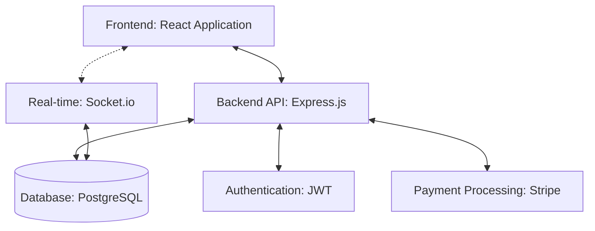
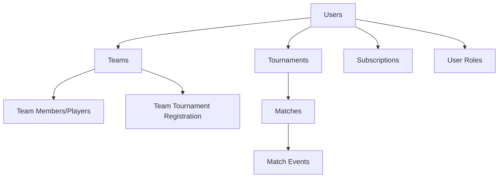
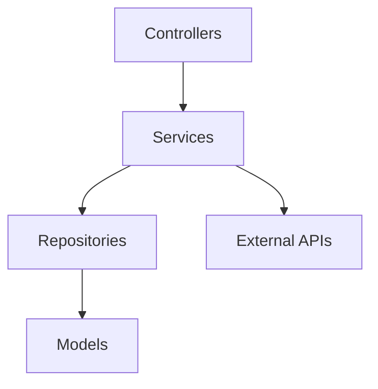
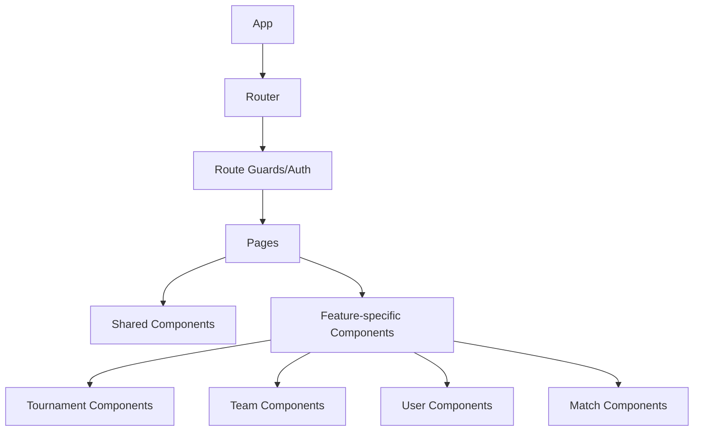
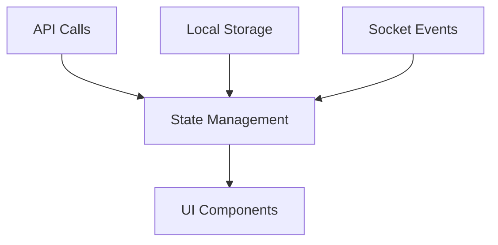
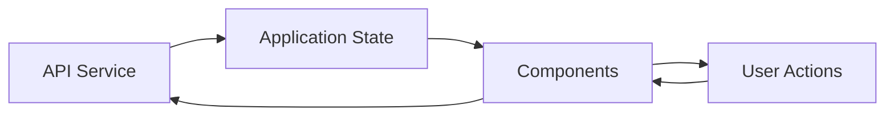
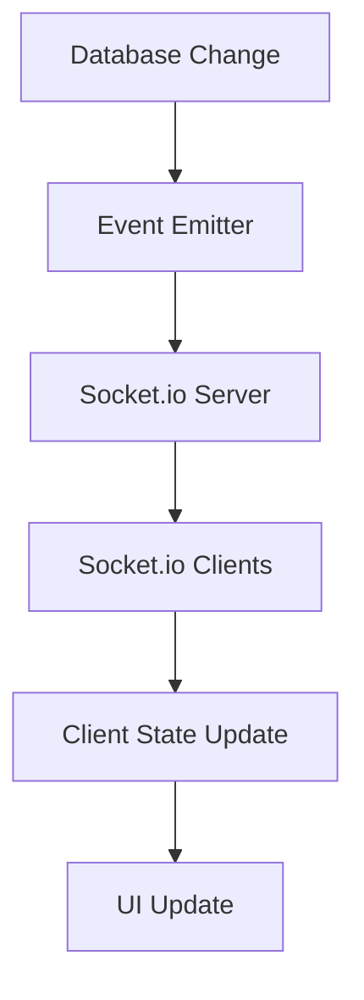
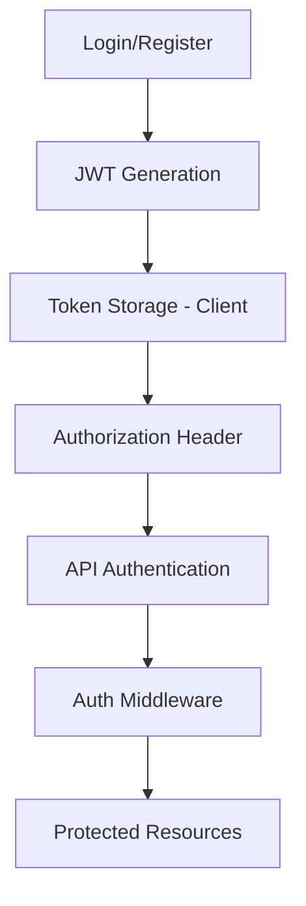
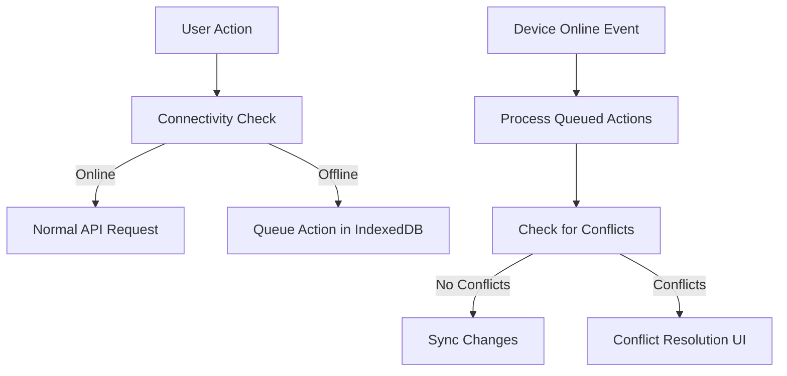

# Verzot: System Patterns

## System Architecture

Verzot follows a modern web application architecture with clearly separated concerns:



### Core Architecture Principles

1. **API-First Design**: All functionality is exposed through RESTful APIs
2. **Separation of Concerns**: Clear boundaries between frontend, backend, and database
3. **Real-time Communication**: Socket.io for live updates and notifications
4. **Stateless Authentication**: JWT-based authentication for scalability
5. **Mobile-First Responsive Design**: Frontend optimized for all devices

## Backend Design Patterns

### Core Pattern: Role-Based Access Control (RBAC)

```mermaid
flowchart TD
    User --> UserRoles[User Roles]
    UserRoles --> Permissions[Permissions]
    Permissions --> Resources[Resources]
    
    subgraph "Role Types"
    R1[Organizer]
    R2[Team Leader]
    R3[Referee]
    R4[Player]
    R5[Viewer]
    end
    
    UserRoles --> Role Types
```

The permission system uses a flexible role-based approach where:
- Roles can be context-specific (tournament-level, team-level)
- Permissions cascade based on ownership relationships
- Power levels differentiate capabilities within roles

### Data Model Structure



The database structure follows these key relationships:
- Users can have multiple roles (Organizer, Team Leader, Referee, Player)
- Teams can participate in multiple tournaments
- Players can belong to multiple teams (but only one per tournament)
- Match events record granular data about matches

### Service Layer Architecture



The backend follows a layered architecture:
- **Controllers**: Handle HTTP requests/responses and basic validation
- **Services**: Implement business logic and orchestrate operations
- **Repositories**: Manage data access and transactions
- **Models**: Define data structure and relationships

## Frontend Architecture

### Component Structure



The frontend follows a modular component hierarchy:
- Core layout components are reused across pages
- Feature-specific components encapsulate business logic
- Components are organized by domain (tournaments, teams, matches)
- Presentational components are separated from container components

### State Management



State is managed through:
- Context API for global application state
- Local state for component-specific concerns
- Service modules for API interactions
- Local storage for offline capabilities and persistence

### Data Flow Pattern



The frontend follows a unidirectional data flow:
1. User actions trigger API calls or state updates
2. State changes propagate to components
3. Components render based on current state
4. Socket events can update state directly

## Integration Patterns

### Real-Time Updates



Real-time updates follow this pattern:
1. Changes to database records trigger events
2. Events are broadcast to relevant clients via socket rooms
3. Clients update their local state
4. UI components re-render with updated data

### Authentication Flow



The authentication system uses JWT tokens:
1. Login/registration generates JWT tokens
2. Tokens are stored in the client (local storage/cookies)
3. Requests include tokens in headers
4. Backend middleware validates tokens
5. User identity and roles are verified for access control

### Offline Capability Pattern



Offline functionality follows this approach:
1. Check connectivity before API requests
2. Queue actions locally when offline
3. Sync when connectivity is restored
4. Handle conflicts with resolution strategies

## Design Patterns in Use

1. **Repository Pattern**: Abstraction layer between data models and business logic
2. **Dependency Injection**: Services and repositories are injected where needed
3. **Observer Pattern**: For real-time updates via Socket.io
4. **Factory Pattern**: Creating model instances and DTOs
5. **Adapter Pattern**: Integration with external services (Stripe, etc.)
6. **Strategy Pattern**: Different rules for tournament formats
7. **Command Pattern**: For queueing offline actions
8. **Decorator Pattern**: For adding features to entities based on subscription tier 