# Verzot: System Patterns

## System Architecture

Verzot follows a modern web application architecture with clearly separated concerns:

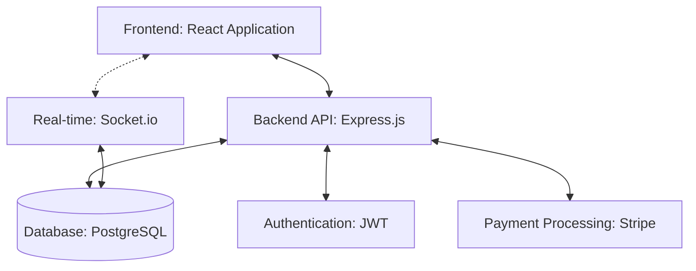

### Core Architecture Principles

1. **API-First Design**: All functionality is exposed through RESTful APIs
2. **Separation of Concerns**: Clear boundaries between frontend, backend, and database
3. **Real-time Communication**: Socket.io for live updates and notifications
4. **Stateless Authentication**: JWT-based authentication for scalability
5. **Mobile-First Responsive Design**: Frontend optimized for all devices

## Backend Design Patterns

### Core Pattern: Role-Based Access Control (RBAC)

```mermaid
flowchart TD
    User --> UserRoles[User Roles]
    UserRoles --> Permissions[Permissions]
    Permissions --> Resources[Resources]
    
    subgraph "Role Types"
    R1[Organizer]
    R2[Team Leader]
    R3[Referee]
    R4[Player]
    R5[Viewer]
    end
    
    UserRoles --> Role Types
```

The permission system uses a flexible role-based approach where:
- Roles can be context-specific (tournament-level, team-level)
- Permissions cascade based on ownership relationships
- Power levels differentiate capabilities within roles

### Data Model Structure

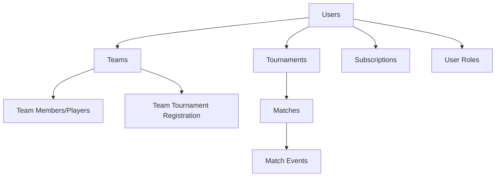

The database structure follows these key relationships:
- Users can have multiple roles (Organizer, Team Leader, Referee, Player)
- Teams can participate in multiple tournaments
- Players can belong to multiple teams (but only one per tournament)
- Match events record granular data about matches

### Service Layer Architecture

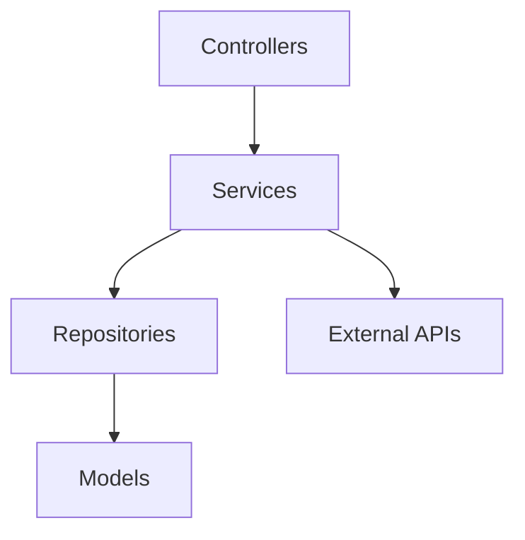

The backend follows a layered architecture:
- **Controllers**: Handle HTTP requests/responses and basic validation
- **Services**: Implement business logic and orchestrate operations
- **Repositories**: Manage data access and transactions
- **Models**: Define data structure and relationships

### Match Controller Implementation Pattern

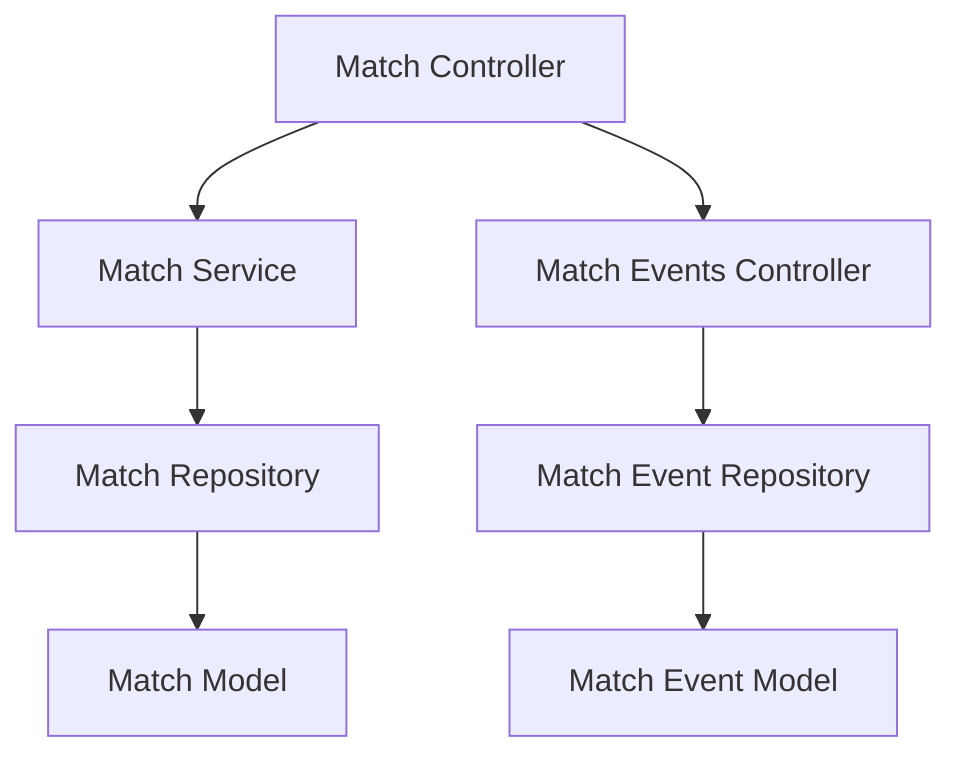

The Match controller follows these implementation patterns:
- **RESTful API Design**: Standard CRUD operations with consistent endpoints
- **Validation Middleware**: Request validation before handler execution
- **Authentication & Authorization**: Role-based permissions for match operations
- **Soft Deletion**: Using `deletedAt` timestamp for recoverable deletions
- **Comprehensive Error Handling**: Standardized error responses with appropriate HTTP status codes
- **Query Parameter Filtering**: Flexible endpoint querying (by tournament, team, date range)
- **Transaction Management**: ACID compliance for related operations
- **Event-Based Updates**: Triggers for real-time notifications

#### Match Controller Endpoints

1. **Core CRUD Operations**:
   - `GET /matches`: List matches with filtering options
   - `GET /matches/:id`: Get match details by ID
   - `POST /matches`: Create a new match
   - `PUT /matches/:id`: Update match details
   - `DELETE /matches/:id`: Soft delete a match

2. **Tournament-Specific Operations**:
   - `GET /tournaments/:id/matches`: Get matches for a specific tournament
   - `POST /tournaments/:id/matches`: Create matches for a tournament
   - `GET /tournaments/:id/matches/schedule`: Get tournament schedule

3. **Match Event Management**:
   - `GET /matches/:id/events`: Get events for a specific match
   - `POST /matches/:id/events`: Add event to a match
   - `PUT /matches/:id/events/:eventId`: Update match event
   - `DELETE /matches/:id/events/:eventId`: Remove match event

4. **Match Status Management**:
   - `PUT /matches/:id/status`: Update match status
   - `PUT /matches/:id/result`: Update match result
   - `PUT /matches/:id/confirm`: Confirm match result

### User Controller Implementation Pattern

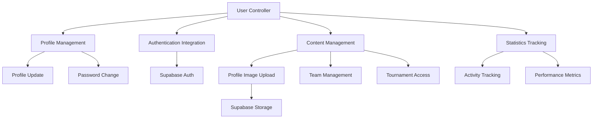

The User controller follows these implementation patterns:
- **Profile Management**: Comprehensive user profile update capabilities
- **Authentication Integration**: Seamless connection with Supabase Auth
- **Content Management**: Handling user-generated content and relationships
- **Statistics Tracking**: Aggregating user activity and performance data

#### User Controller Endpoints

1. **Profile Management**:
   - `GET /users/:userId`: Get user profile by ID
   - `PUT /users/profile`: Update current user profile
   - `PUT /users/password`: Change user password

2. **Content Management**:
   - `POST /users/profile/image`: Upload profile image to Supabase Storage
   - `GET /users/teams`: Get teams owned by current user
   - `GET /users/:userId/teams`: Get teams owned by specific user
   - `GET /users/tournaments`: Get tournaments organized by current user
   - `GET /users/:userId/tournaments`: Get tournaments organized by specific user

3. **Statistics & Activity**:
   - `GET /users/statistics`: Get current user's activity statistics
   - `GET /users/:userId/statistics`: Get specific user's activity statistics

## Frontend Architecture

### Service Layer Implementation

```mermaid
flowchart TD
    Components --> Services[Service Layer]
    Services --> API[API Module]
    API --> Backend[Backend API]
    Services --> LocalStorage[Local Storage]
    
    subgraph "Service Modules"
    AuthService[Auth Service]
    TournamentService[Tournament Service]
    TeamService[Team Service]
    end
    
    Services --> Service Modules
```

The frontend implements a comprehensive service layer that:
- Abstracts API communication from components
- Handles authentication token management
- Provides specialized services for different entity types
- Manages error handling and loading states
- Handles local storage for state persistence

#### Core Service Modules

1. **Base API Service**:
   - Manages HTTP requests using Axios
   - Configures request interceptors for authentication
   - Handles response interceptors for error processing
   - Manages authentication tokens automatically
   - Provides centralized error handling

2. **Auth Service**:
   - Handles user registration and login
   - Manages user profiles
   - Stores and retrieves tokens from local storage
   - Provides authentication state utilities

3. **Tournament Service**:
   - Implements CRUD operations for tournaments
   - Manages tournament teams and registrations
   - Handles filtering and search capabilities
   - Processes tournament-specific operations

4. **Team Service**:
   - Implements CRUD operations for teams
   - Manages team membership and players
   - Provides filtering and search capabilities
   - Handles tournament registration for teams

### Component Structure

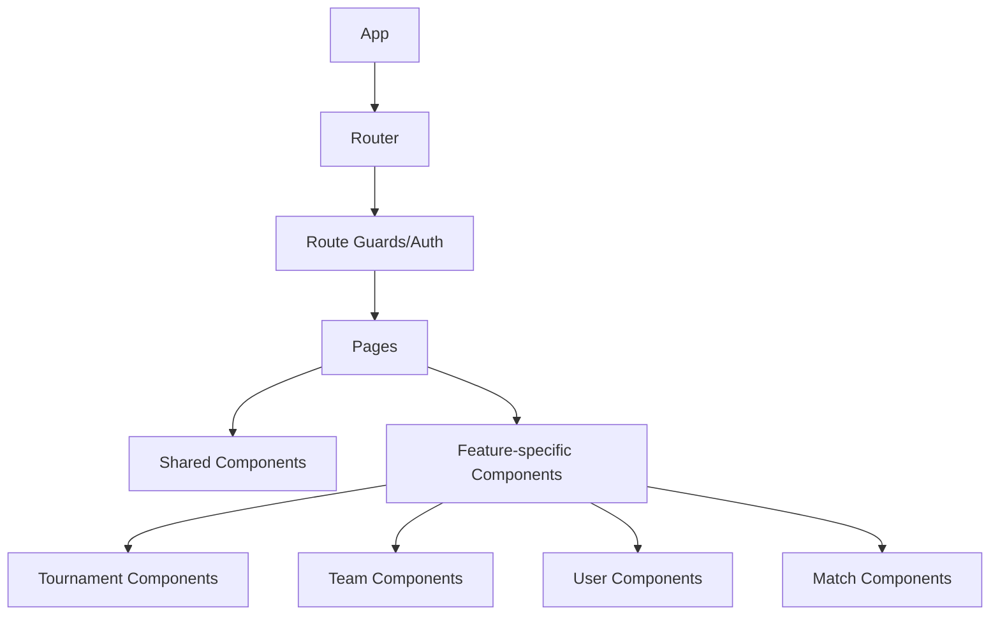

The frontend follows a modular component hierarchy:
- Core layout components are reused across pages
- Feature-specific components encapsulate business logic
- Components are organized by domain (tournaments, teams, matches)
- Presentational components are separated from container components

### State Management

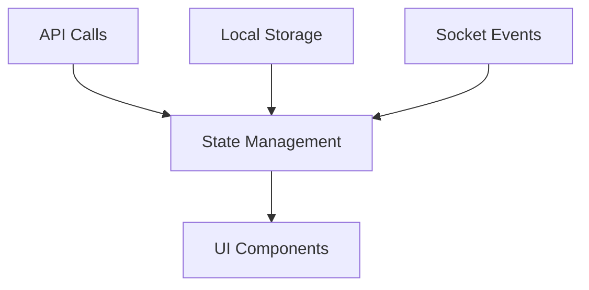

State is managed through:
- Context API for global application state
- Local state for component-specific concerns
- Service modules for API interactions
- Local storage for offline capabilities and persistence

### Data Flow Pattern

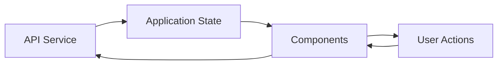

The frontend follows a unidirectional data flow:
1. User actions trigger API calls or state updates
2. State changes propagate to components
3. Components render based on current state
4. Socket events can update state directly

## Integration Patterns

### Authentication Flow

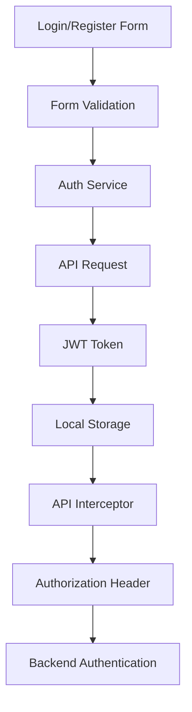

The enhanced authentication flow:
1. User enters credentials in login/register form
2. Form validates inputs client-side
3. Auth service sends credentials to API
4. API returns JWT token on success
5. Token stored in local storage
6. API interceptor attaches token to all subsequent requests
7. Expired tokens trigger redirect to login

### Real-Time Updates

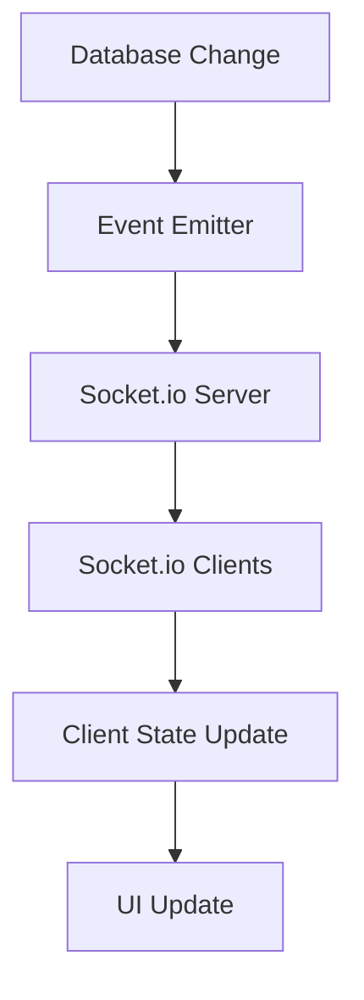

Real-time updates follow this pattern:
1. Changes to database records trigger events
2. Events are broadcast to relevant clients via socket rooms
3. Clients update their local state
4. UI components re-render with updated data

### Offline Capability Pattern

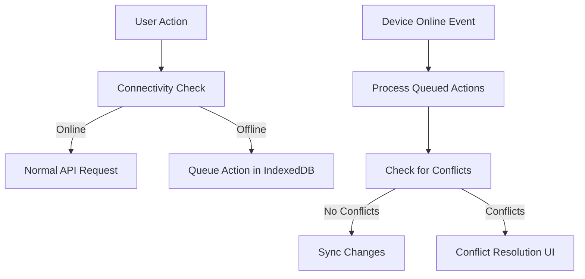

Offline functionality follows this approach:
1. Check connectivity before API requests
2. Queue actions locally when offline
3. Sync when connectivity is restored
4. Handle conflicts with resolution strategies

## Design Patterns in Use

1. **Repository Pattern**: Abstraction layer between data models and business logic
2. **Dependency Injection**: Services and repositories are injected where needed
3. **Observer Pattern**: For real-time updates via Socket.io
4. **Factory Pattern**: Creating model instances and DTOs
5. **Adapter Pattern**: Integration with external services (Stripe, etc.)
6. **Strategy Pattern**: Different rules for tournament formats
7. **Command Pattern**: For queueing offline actions
8. **Decorator Pattern**: For adding features to entities based on subscription tier
9. **Module Pattern**: For organizing frontend service layer
10. **Interceptor Pattern**: For handling authentication in API requests
11. **Facade Pattern**: Service layer providing simplified interface to backend API

## Notification System Pattern

```mermaid
flowchart TD
    subgraph "System Events"
        E1[Match Events] 
        E2[Tournament Status Changes]
        E3[Team Registrations]
        E4[User Actions]
    end
    
    subgraph "Notification Service"
        NS1[Create Notification]
        NS2[Send Email]
        NS3[Store in Database]
    end
    
    subgraph "Notification Types"
        NT1[Match Result]
        NT2[Match Event]
        NT3[Tournament Status]
        NT4[Registration Status]
        NT5[Team Invitation]
        NT6[System Announcement]
        NT7[Match Confirmation]
    end
    
    subgraph "Delivery Methods"
        D1[In-App Notification]
        D2[Email Notification]
        D3[Real-time Socket Update]
    end

    subgraph "User Preferences"
        UP1[Email Settings]
        UP2[Notification Types]
        UP3[Digest Frequency]
    end
    
    System Events --> NS1
    NS1 --> NS3
    NS1 --> NS2
    NS1 --> Notification Types
    Notification Types --> Delivery Methods
    UP1 --> D2
    UP2 --> Notification Types
    UP3 --> D2
```

### Notification Service Implementation Pattern

The Notification system uses a service-based architecture to create, store, and deliver notifications to users:

1. **Notification Creation**:
   - `createNotification`: Core method for creating notifications with custom metadata
   - Type-specific factory methods for creating different notification types:
     - `createMatchResultNotification`: For match score updates
     - `createMatchEventNotification`: For significant match events (goals, red cards)
     - `createTournamentStatusNotification`: For tournament status changes
     - `createRegistrationStatusNotification`: For team registration status updates
     - `createTeamInvitation`: For team membership invitations
     - `createTournamentInvitation`: For tournament participation invitations
     - `createSystemAnnouncement`: For system-wide announcements

2. **Email Integration**:
   - `sendEmailNotification`: Sends email notifications (configured with nodemailer)
   - Support for HTML and plain text email formats
   - Template-based email generation with consistent branding
   - Respects user email preferences from NotificationPreference model

3. **Notification Triggers**:
   - Match controller integration for match events and results
   - Tournament controller integration for status changes and registrations
   - Team controller integration for team invitations and membership changes
   - System-level triggers for announcements and maintenance notices

4. **Notification Metadata**:
   - Rich metadata storage for context-specific information
   - Support for deep linking to relevant content
   - Structured data for client-side rendering options

5. **User Preferences**:
   - `NotificationPreference` model stores user notification settings
   - Per-user configuration for email notifications
   - Digest frequency options (realtime, daily, weekly, never)
   - Category-based preferences (match, tournament, team, system)
   - Unsubscribe functionality with secure tokens
   - Default preferences for new users

### Notification System Components

The notification system encompasses:

1. **Backend Models**:
   - `Notification`: Core model for storing notifications with type, message, read status, and metadata
   - `NotificationPreference`: Model for storing user preferences about notifications

2. **Backend Controller**:
   - `getUserNotifications`: Retrieves notifications with filtering and pagination
   - `getUnreadCount`: Returns count of unread notifications
   - `markAsRead`: Marks specific notification as read
   - `markAllAsRead`: Marks all notifications as read
   - `deleteNotification`: Deletes a specific notification
   - `clearAllNotifications`: Removes all notifications for a user
   - `getUserPreferences`: Retrieves user notification preferences
   - `updatePreferences`: Updates user notification preferences
   - `unsubscribe`: Handles public unsubscribe requests via token

3. **Frontend Components**:
   - `NotificationContext`: Global state provider for notification data
   - `NotificationService`: API service for notification operations
   - `NotificationBadge`: Header component displaying unread count
   - `Notifications`: Page component for listing and managing notifications
   - `NotificationPreferences`: Page component for managing notification settings
   - `NotificationFilters`: Component for filtering notifications by type and read status
   - `NotificationItem`: Component for displaying individual notifications

The notification system emphasizes:
- **Non-blocking operation**: Notification failures don't impact primary operations
- **Graceful degradation**: If email sending fails, in-app notifications still work
- **Prioritization**: Support for normal, high, and urgent notification priorities
- **Expiration**: Notifications can have expiration dates for time-sensitive information
- **Delivery tracking**: Records when notifications are sent, viewed, and acted upon
- **User Control**: Comprehensive preference management for notification frequency and channels

### NotificationPreferences Implementation

The notification preferences system provides users with fine-grained control over their notification experience:

1. **Preference Categories**:
   - Global email notification toggle
   - Email digest frequency settings
   - Match notifications (goals, red cards, results, confirmations)
   - Tournament notifications (status changes, registrations)
   - Team notifications (invitations, membership changes)
   - System notifications (announcements, maintenance)

2. **User Interface Components**:
   - Toggle switches for enabling/disabling notification types
   - In-app vs. email delivery options for each notification type
   - Global settings section for email preferences
   - Category-based organization of notification types
   - Clear labels and descriptions for each notification type
   - Mobile-responsive design for all preference controls

3. **Preference Storage**:
   - Stored in the `NotificationPreference` model
   - Default preferences created for new users
   - Updates applied immediately when preferences are changed
   - Cached in frontend state for fast access

4. **Implementation Considerations**:
   - Default to on for critical notifications
   - Allow granular control for frequent notifications
   - Provide clear preview of what each notification type looks like
   - Respect user choices strictly to build trust
   - Implement unsubscribe links in all email notifications

This system provides a consistent way for different parts of the application to notify users about relevant events without tight coupling between components, while giving users control over their notification experience.

## Tournament Management Pattern

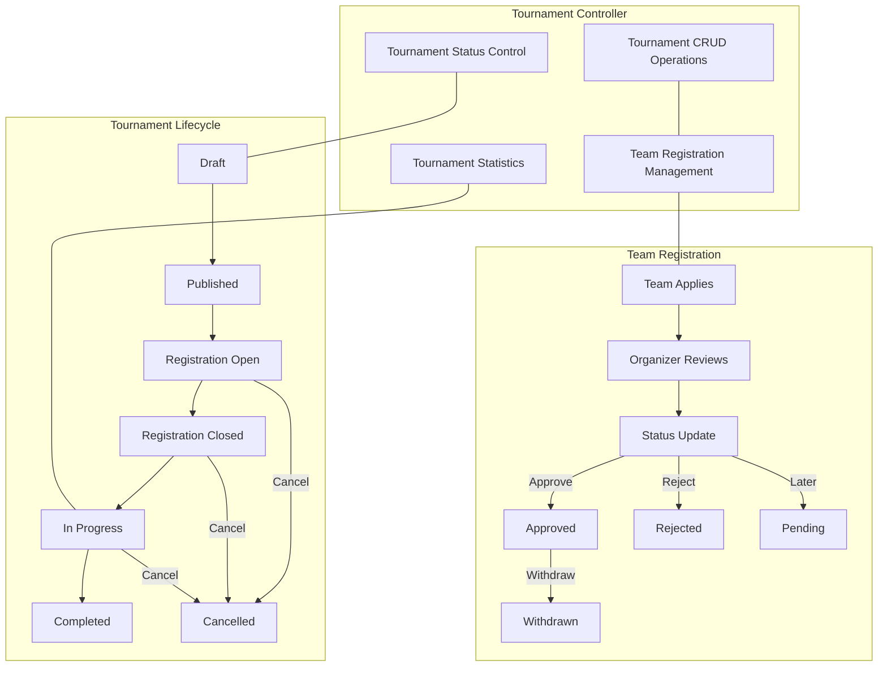

### Tournament Controller Implementation Pattern

The Tournament controller implements a comprehensive system for managing tournaments, team registrations, and tournament statistics:

1. **Tournament CRUD Operations**:
   - `createTournament`: Creates a new tournament with organizer, format, and registration settings
   - `getTournaments`: Retrieves tournaments with filtering options
   - `getTournamentById`: Gets detailed tournament information including teams and matches
   - `updateTournament`: Updates tournament details
   - `deleteTournament`: Soft-deletes a tournament

2. **Team Registration Management**:
   - `registerTeam`: Allows team leaders to register for tournaments
   - `getTournamentTeams`: Lists teams registered for a tournament
   - `updateTeamRegistration`: Enables organizers to approve/reject registrations
   - `withdrawTeam`: Allows teams to withdraw from tournaments

3. **Tournament Status Control**:
   - `updateTournamentStatus`: Manages tournament lifecycle with validation
   - Status flow: draft → published → registration-open → registration-closed → in-progress → completed
   - Status can be set to 'cancelled' from certain states

4. **Tournament Statistics and Standings**:
   - `getTournamentStandings`: Calculates and returns standings by group
   - `getTournamentStatistics`: Provides comprehensive statistics (matches, goals, top scorers)
   - Standings include points, goal difference, goals for/against
   - Support for different tournament formats (group stage, knockout, etc.)

This implementation emphasizes role-based access control, with different permissions for team leaders and tournament organizers. The controller also includes validation checks for status transitions, registration deadlines, and team eligibility. 